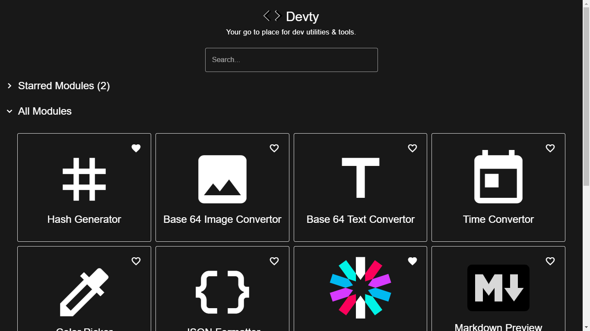

<a href="https://devty.vercel.app"><h1 align="center">

Devty

</h1></a>

    Developers Utilities & Tools. 
    This tool is inspired from 
    <a href="https://devutils.com/" >DevUtils</a>

## How does it works?

Devty doesn't have any backend, it uses browser APIs and libraries to provide tools. For example the [`Hash Generator`](https://devty.vercel.app/hash_generator) tool uses [`Google's CryptoJS Library`](https://www.npmjs.com/package/crypto-js) to generate different hash of a given string directly in your browser

**Devty doesn't have any backend and is a frontend specific app. No data is ever sent to the backend**

## How can I add my custom module?

Please read the [`Adding Custom Modules`](docs/ADDING_CUSTOM_MODULE.md) section in `docs`

## Attribution

This project uses [`DevUtils`](https://devutils.com) as inspiration.
